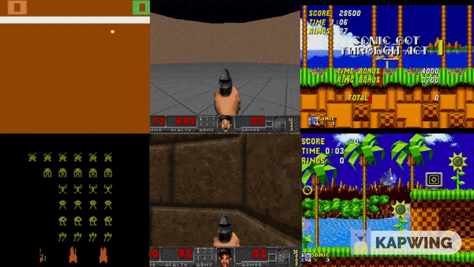
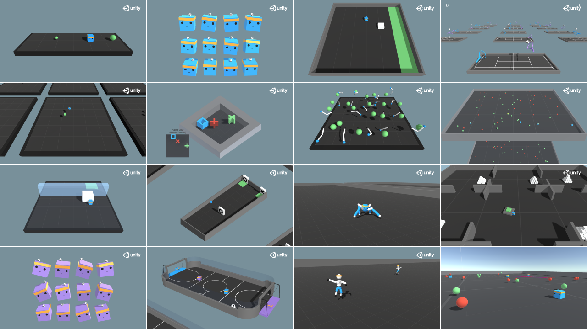

# [Deep Reinforcement Learning](https://deepanshut041.github.io/Reinforcement-Learning/)

This repository contain my work regarding Deep Reinforcment Learning. You will find the main topics organized by squence with there implementaion in PyTorch. Also, It contains some of my project or links on reinforcment learning. You are highly encouraged to modify and play with them!.

- [Benchmarking DRL Algorithms on Classic Games](#discrete) (discrete)
- [Benchmarking DRL Algorithms on Unity Ml Agents](#continous) (continous)

___

## Notes

##  Benchmarking DRL Algorithm(Discrete) on Classic Games

We used classic games from OpenAI Gym and Vizdoom as our main testbed to study the behaviour of the following algorithms:

 1. DQN — Deep Q-learning
 2. DDQN — Dueling DQN
 3. Rainbow
 4. Reinforce + Actor Critic
 5. A2C — Advantage Actor Critic
 6. PPO — Proximal Policy Optimization

We compare the results of launch of six algorithms on games from two perspectives: Traning and Testing. Same Deep Neural Network is used for all algorithms. Click on particular game for more information.

##  Benchmarking DRL Algorithm(Continous) on Unity Ml Agents

We used mlagents from Unity as our main testbed to study the behaviour of the following algorithms:

 1. PPO - Proximal Policy Optimization
 2. DDPG - Deep Deterministic Policy Gradient
 3. TD3 - Twin Delayed DDPG
 4. SAC - Soft Actor-Critic

We compare the results of launch of six algorithms on games from two perspectives: Traning and Testing. Same Deep Neural Network is used for all algorithms. Click on particular game for more information.
